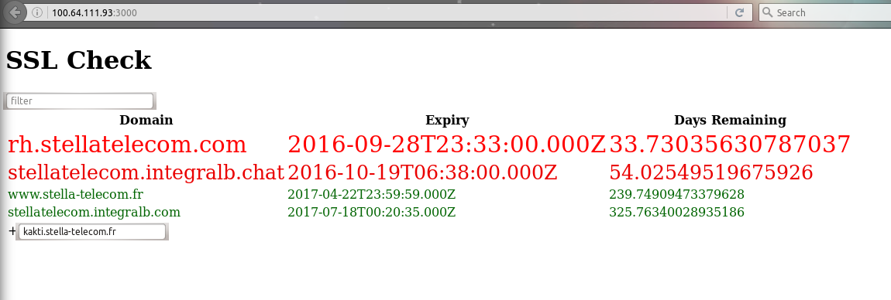
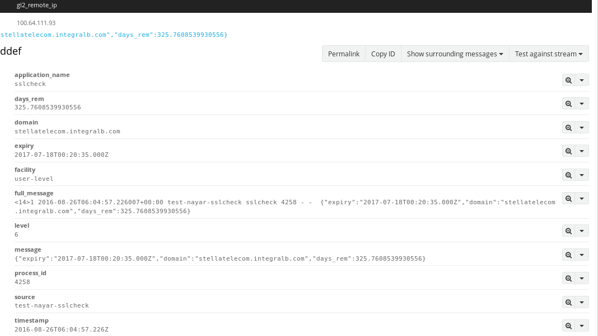
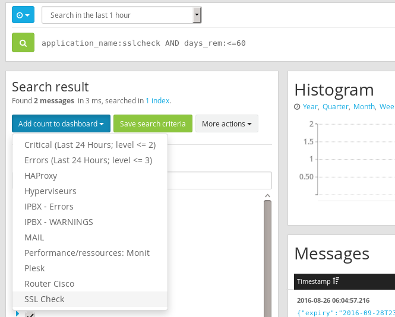
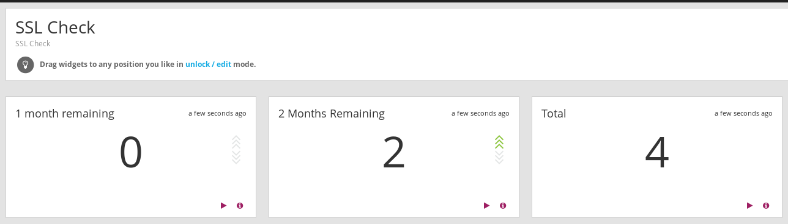
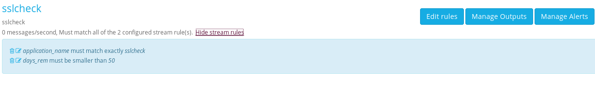
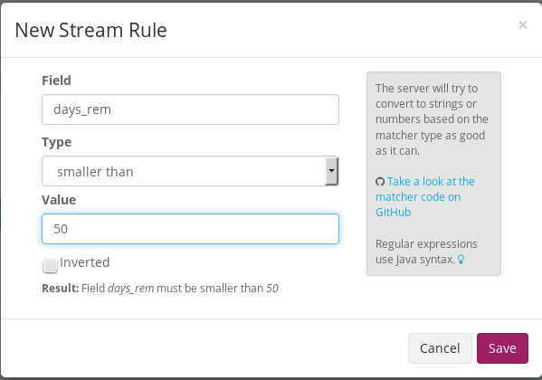
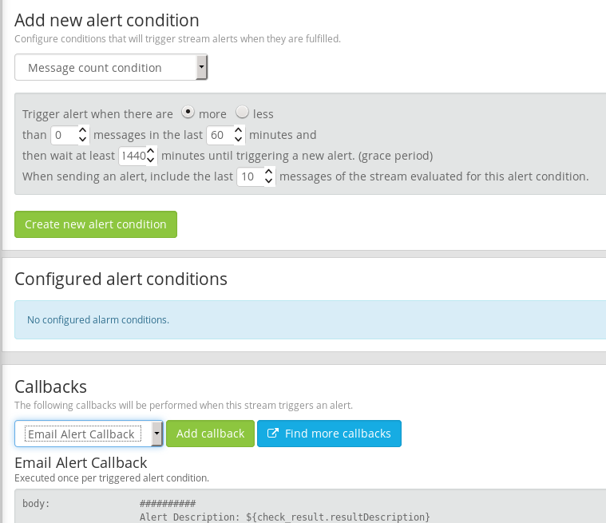
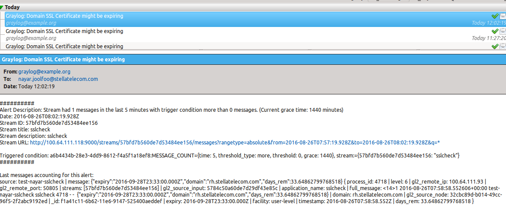

# Analysis (R&D)
## Finding expiry date using CLI ^[http://www.shellhacks.com/en/HowTo-Check-SSL-Certificate-Expiration-Date-from-the-Linux-Shell]

```
$ echo | openssl s_client -connect rh.stellatelecom.com:443 -servername rh.stellatelecom.com 2>/dev/null | openssl x509 -noout -dates

```

# Design
## UI



### Features

- The lesser days remain, the text becomes bigger
- The lesser days remain, the text becomes more red
- Sorting by domain name or days remaining
- Filter by domain name
- Add new domains on interface

## Operation

Each hour, the application will write logs to the journald in this fashion

```
Aug 26 06:04:57 test-nayar-sslcheck sslcheck[4258]: {"expiry":"2017-07-18T00:20:35.000Z","domain":"stellatelecom.integralb.com","days_rem":325.7608539930556}
```

The log is sent to graylog where it is analyzed (Fig. \ref{img2}).



Counters are added to Graylog dashboard (Fig. \ref{img3})



The Graylog Dashboard (Fig. \ref{img4})



## Alerting with Graylog

A stream `sslcheck` is created to match all logs generated from application `sslcheck` (Fig \ref{img5}]).







An email is received like in Fig \ref{img8})



# TODO

- Use Websocket for live updates
- Add bootstrap CSS or alternatives
- Field validation